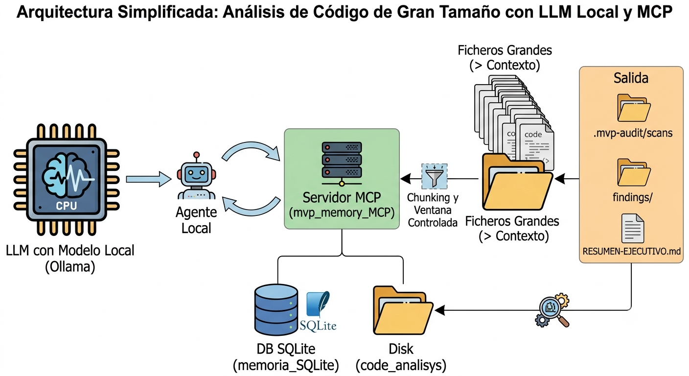
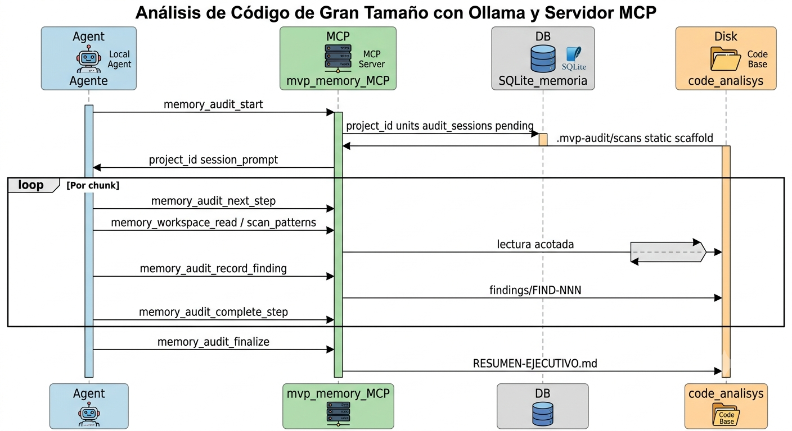
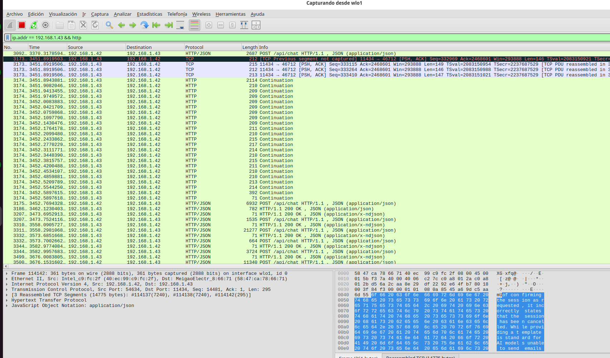
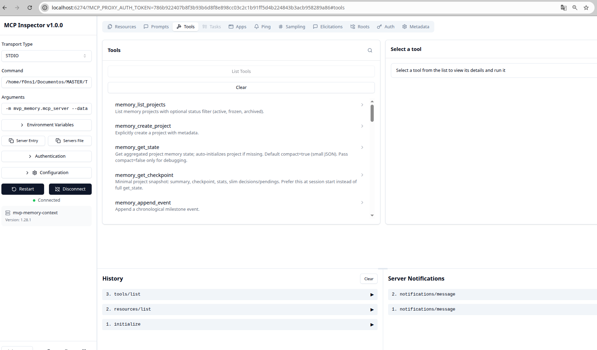

# MVP Memory Context

Control de ventana de contexto para **auditoría de código en local** con agentes (Ollama, Cline, Continue, Cursor). Servidor **MCP** con memoria persistente (SQLite), plan de trabajo acotado e informes en disco. Panel web de administración en `127.0.0.1`.

## Componentes (vista de alto nivel)

Agente IDE, LLM local, servidor MCP, SQLite y artefactos en disco (`<repo>/.mvp-audit/`) trabajan juntos para no saturar la ventana de contexto del modelo.



## El problema de los agentes locales y la ventana de contexto

Si ejecutas un agente de IA en local (por ejemplo con **Ollama**) sobre un repositorio grande o recién clonado, suele aparecer el mismo límite: poca memoria del host y una **ventana de contexto** que no cabe todo el código.

Volcar archivos enormes al LLM de golpe provoca colapso de memoria, pérdida de atención (respuestas incompletas o alucinaciones) o errores del tipo *context overflow*.

### Cómo lo aborda este proyecto (MCP como gestor de contexto)

En lugar de ahogar al modelo con datos, la **fontanería pesada** vive en un servidor [Model Context Protocol](https://modelcontextprotocol.io/):

| Capacidad | Qué hace |
|-----------|----------|
| Indexado y chunking | Fragmenta el código en unidades manejables; el agente lee trozos vía `memory_workspace_read`, no pegando el repo en el chat. |
| Ventana acotada | El análisis avanza **paso a paso** (`memory_audit_next_step` → unidad → cierre con `memory_audit_complete_step`). |
| Perfiles y memoria | Estado de la auditoría en SQLite local; hallazgos en `<repo>/.mvp-audit/` sin depender del historial del chat. |
| Agente + LLM local | El **agente** (Cline/Cursor/Continue) decide cuándo llamar al LLM; el MCP **orquesta datos, plan y persistencia** chunk a chunk hasta un `RESUMEN-EJECUTIVO.md` (`memory_audit_finalize`). |

**Experiencia para quien audita:** un prompt claro (“audita este repo con perfil X”). El agente usa las tools MCP; tú no calculas IDs ni troceas archivos a mano.

Guías en el propio servidor MCP: prompts `audit-quickstart`, `audit-orchestration` (Inspector: `./scripts/run-mcp-inspector.sh`).

## Flujo de control y comunicación entre actores

Secuencia típica: el usuario pide la auditoría al agente; el agente invoca tools MCP (plan, lectura acotada, registro de hallazgos); el LLM local analiza solo los fragmentos necesarios; el MCP persiste estado e informes.



### Paginación autónoma de la ventana de contexto (captura Wireshark)

En una auditoría real, el agente no envía el repositorio entero en una sola petición: alterna llamadas al **LLM local** con invocaciones **MCP** (`memory_audit_next_step`, `memory_workspace_read`, etc.). En el tráfico se ve una secuencia de rondas acotadas en lugar de un único bloque que supere el límite de contexto.



## Instalación

```bash
git clone <URL-del-repo> MVP-code-analisys-full-context-control
cd MVP-code-analisys-full-context-control
chmod +x scripts/*.sh
./scripts/install.sh
```

Datos por defecto: `~/.local/share/mvp-memory-context/`  
Token admin (API): `~/.config/mvp-memory-context/admin.token` (se crea al primer arranque de la API).

## MCP (stdio)

```bash
chmod +x scripts/*.sh
```

### MCP Inspector (depurar tools y prompts)

```bash
./scripts/run-mcp-inspector.sh
```

Abre la UI web; prueba **Prompts** (`audit-quickstart`, `audit-orchestration`) y **Tools** (`memory_audit_start`).



### MCP stdio (producción / Cline)

```bash
./scripts/run-mcp.sh
```

### Cursor / Cline (`mcp.json`)

```json
{
  "mcpServers": {
    "mvp-memory-context": {
      "command": "/ruta/al/clon/.venv/bin/python",
      "args": [
        "-m", "mvp_memory.mcp_server",
        "--data-dir", "/home/USER/.local/share/mvp-memory-context"
      ]
    }
  }
}
```

Cline: `~/.config/Code/User/globalStorage/saoudrizwan.claude-dev/settings/cline_mcp_settings.json`  
Cursor: `~/.cursor/mcp.json`

### Continue + VS Code (memoria de estado — recomendado)

Guía completa: [`prompts/continue-memoria-generico.md`](prompts/continue-memoria-generico.md)

Por proyecto:

```bash
./scripts/scaffold-continue-project.sh /ruta/absoluta/al/repo TU_PROJECT_ID
```

Copia `.continue/mcpServers/mvp-memory-context.json` + rules. **Un solo** registro MCP (workspace **o** Main Config, no ambos).

Flujo agente: **`memory_get_checkpoint`** → trabajar → **`memory_update_summary`** / `memory_add_file_ref`. Evitar `get_state` full.

Plantilla JSON (ajusta ruta `command`):

```json
{
  "mcpServers": {
    "mvp-memory-context": {
      "type": "stdio",
      "command": "/path/to/MVP-memory-context/.venv/bin/mvp-memory-mcp",
      "args": ["--data-dir", "/home/USER/.local/share/mvp-memory-context"],
      "timeout": 300,
      "autoApprove": ["memory_get_checkpoint", "memory_update_summary", "..."]
    }
  }
}
```

Tras editar: Reload Window → Tools → mvp-memory-context → **Automatic**.

### Continue (YAML legacy — preferir JSON + scaffold)

En el workspace del agente (ej. `attacker-agent/.continue/mcpServers/mvp-memory-context.yaml`):

```yaml
name: mvp-memory-context
version: 0.2.0
schema: v1
mcpServers:
  - name: mvp-memory-context
    command: /ruta/al/clon/.venv/bin/python
    args:
      - -m
      - mvp_memory.mcp_server
      - --data-dir
      - /home/USER/.local/share/mvp-memory-context
    env: {}
```

Tras editar: recarga Continue (Reload Window).

### MCP SSE (v0.2, opcional)

```bash
./scripts/run-mcp.sh --transport sse --host 127.0.0.1 --port 8766
```

### Búsqueda semántica local (v0.2)

Embeddings locales tipo bag-of-hashes (sin cloud):

```bash
./scripts/run-mcp.sh --semantic
# o
export MVP_MEMORY_SEMANTIC=1
```

## Panel web

```bash
./scripts/run-api.sh
```

Abrir http://127.0.0.1:8765 e introducir el token de `admin.token`.

Funciones: lista de proyectos, detalle, timeline, búsqueda, editor, export/import, auditoría, congelar, wipe, break-glass de locks.

## Identificador de proyecto

Se **genera solo** al usar `memory_audit_start(target_directory=...)`.  
Opcional (manual): `project_id_from_workspace("/ruta")`.

## Auditoría de código (flujo principal)

```text
memory_list_audit_profiles()
memory_get_audit_prompt("js-console-api", "/ruta/codigo")   # opcional: ver config + prompt

memory_audit_start(
  target_directory="/ruta/absoluta/al/codigo",
  profile_id="security-baseline",   # o js-console-api
  output_dir=".mvp-audit"             # configurable; default del perfil
)
```

Respuesta incluye: `project_id`, `output_dir`, `session_prompt`, escaneos en `output_dir/scans/`.

Bucle:

```text
memory_audit_next_step → memory_workspace_read / scan_patterns → analizar con el LLM
→ memory_audit_record_finding (cada hallazgo → FIND-* en disco)
→ memory_audit_complete_step
→ repetir hasta agotar el plan
→ memory_audit_finalize (RESUMEN-EJECUTIVO.md)
```

Perfiles JSON (editable): [`src/mvp_memory/audit_profiles/`](src/mvp_memory/audit_profiles/) (`security-static-first`, `security-full`, `js-console-api`, …).

Prompts MCP nativos (recomendado): `audit-quickstart`, `audit-orchestration`, `audit-<profile_id>`. Alternativa vía tools: `memory_list_audit_prompts`, `memory_get_audit_prompt`.


Copia la plantilla desde [`prompts/nueva-tarea-cline.md`](prompts/nueva-tarea-cline.md). Resumen mínimo:

```text
Usa el MCP mvp-memory-context. project_id: <ID>. workspace_path: <RUTA>.
1) memory_get_checkpoint(project_id, auto_create=true) o memory_get_agent_guide(client="cline").
2) No inventes contexto; memory_search si hace falta.
Tarea: <objetivo>, alcance: <…>, hecho cuando: <…>.
Al cerrar hitos: lock → append/update_summary(checkpoint) → release lock.
Empieza con checkpoint + plan en 3–5 pasos.
```

Obtener `project_id`:  
`python -c "from mvp_memory.config import project_id_from_workspace; print(project_id_from_workspace('/ruta/repo'))"`

## Disciplina del agente

1. Inicio de sesión: `memory_get_checkpoint` o `memory_get_agent_guide`.
2. No inventar contexto ausente; usar `memory_search` si hace falta detalle.
3. Al cerrar un hito: `memory_acquire_lock` → append/update → `memory_update_summary` (checkpoint) → `memory_release_lock`.
4. `memory_delete_entry` solo con `confirm=true` tras aprobación del usuario.
5. Reanudar tareas largas desde `checkpoint` en el estado.

Prompt de invocación: **`memory_get_agent_guide`**.

## Escenario 1 — Codebase grande / auditoría de seguridad

Usar **`memory_audit_start`** (ver sección anterior). No hace falta calcular `project_id` a mano.

Perfil **consola JS**: `profile_id="js-console-api"` (PoC en `.mvp-audit/poc/`).

Tools avanzadas (`memory_workspace_*`) solo si necesitas control fino.

## Escenario 2 — Tarea larga (deriva / pérdida de contexto)

1. Crear pendientes: `memory_add_pending` por paquete o fase.
2. Tras completar fase: `memory_resolve_pending`, `memory_append_event`, `memory_update_summary` con checkpoint.
3. Errores de CI: `memory_log_error`; recuperar con `memory_search` sin depender del historial del chat.
4. Nueva sesión: leer `checkpoint` y pendientes abiertos en `get_state`.
5. Si el agente entra en bucle: congelar proyecto desde el panel.

## Tools MCP

| Tool | Uso |
|------|-----|
| `memory_list_projects` | Listado |
| `memory_create_project` | Alta explícita |
| `memory_audit_start` | **Inicio:** ID auto, plan, scans, árbol output, prompt sesión |
| `memory_audit_status` | Progreso y rutas |
| `memory_audit_next_step` | Siguiente unidad + hints del perfil |
| `memory_audit_complete_step` | Cerrar unidad del plan |
| `memory_audit_record_finding` | Persistir hallazgo (FIND-*.md) en `output_dir` |
| `memory_audit_finalize` | Resumen ejecutivo y cierre de sesión |
| `memory_list_audit_profiles` | Catálogo de configs |
| `memory_list_audit_prompts` | Índice de prompts consultables |
| `memory_get_audit_prompt` | Prompt markdown + JSON del perfil |
| `memory_get_agent_guide` | Guía Cline / Continue / Codex |
| `memory_append_event` | Hitos |
| `memory_add_decision` / `memory_add_pending` / `memory_log_error` / `memory_add_file_ref` | Tipos estructurados |
| `memory_resolve_pending` | Cerrar pendiente |
| `memory_update_summary` | Resumen y checkpoint |
| `memory_search` | FTS (+ semántica opcional) |
| `memory_get_entry` / `memory_update_entry` / `memory_delete_entry` | CRUD con historial |
| `memory_export_project` / `memory_import_project` | Backup |
| `memory_acquire_lock` / `memory_release_lock` | Concurrencia |
| `memory_freeze_project` | Solo lectura para agente |

`memory_purge_entry` está restringido a la API admin (token).

## SQLCipher (opcional, v0.2)

Variable `MVP_MEMORY_SQLCIPHER=1` reserva el flag en configuración. Cifrado en reposo requiere integrar `sqlcipher`/`pysqlcipher3` en una versión posterior; la PoC usa SQLite estándar.

## Tests

```bash
source .venv/bin/activate
pytest
```

## Publicar en GitHub

Checklist y `rsync` para un clon sin BD ni tokens: [`PUBLISH.md`](PUBLISH.md).

## Estructura

```
MVP-memory-context/
├── migrations/001_initial.sql
├── src/mvp_memory/
│   ├── core/          # dominio + SQLite
│   ├── mcp_server/    # MCP stdio/SSE
│   └── api/           # FastAPI + UI estática
├── tests/
└── scripts/
```
