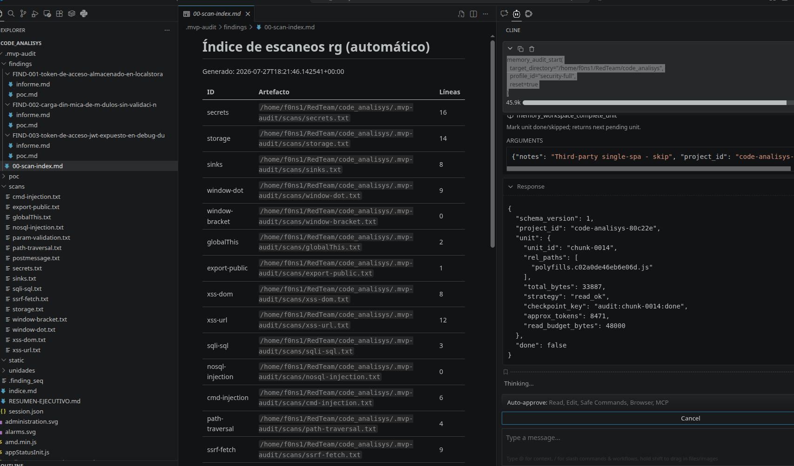

# MVP Memory Context

## El problema de los agentes locales y la ventana de contexto

Si ejecutas un agente de IA en local (por ejemplo con **Ollama**) sobre un repositorio grande o recién clonado, suele aparecer el mismo límite: poca memoria del host y una **ventana de contexto** que no cabe todo el código.

Volcar archivos enormes al LLM de golpe provoca colapso de memoria, pérdida de atención (respuestas incompletas o alucinaciones) o errores del tipo *context overflow*.

El software de este repositorio ofrece una solución completa mediante varias técnicas (indexado, chunking, memoria MCP e informes en disco), simplificando la tarea del auditor.

## Diagrama de componentes a alto nivel

Agente IDE, LLM local, servidor MCP, SQLite y artefactos en disco en el código analizado (`<repo>/.mvp-audit/`).


Control de ventana de contexto para **auditoría de código en local** con agentes (Ollama, **Cline**, Continue, Cursor). Servidor **MCP** con memoria persistente (SQLite), plan de trabajo acotado e informes en disco. Panel web de administración opcional en `127.0.0.1`.

### Cómo lo aborda este proyecto (MCP como gestor de contexto)

En lugar de ahogar al modelo con datos, el flujo de contexto vive en un servidor [Model Context Protocol](https://modelcontextprotocol.io/):

| Capacidad | Qué hace |
|-----------|----------|
| Indexado y chunking | Fragmenta el código en unidades manejables; el agente lee trozos vía `memory_workspace_read`, no pegando el repo en el chat. |
| Ventana acotada | El análisis avanza **paso a paso** (`memory_audit_next_step` → unidad → cierre con `memory_audit_complete_step`). |
| Perfiles y memoria | Estado de la auditoría en SQLite local; hallazgos en `<repo>/.mvp-audit/` sin depender del historial del chat. |
| Agente + LLM local | El **agente** (Cline/Cursor/Continue) decide cuándo llamar al LLM; el MCP **orquesta datos, plan y persistencia** chunk a chunk hasta un `RESUMEN-EJECUTIVO.md` (`memory_audit_finalize`). |

**Experiencia para quien audita:** un prompt claro (“audita este repo con perfil X”). El agente usa las tools MCP; no hace falta calcular IDs ni trocear archivos a mano.

## Flujo de control y comunicación entre actores

Secuencia típica: el usuario pide la auditoría al agente; el agente invoca tools MCP (plan, lectura acotada, registro de hallazgos); el LLM local analiza solo los fragmentos necesarios; el MCP persiste estado e informes.


### Paginación autónoma de la ventana de contexto (captura Wireshark)

En una auditoría real, el agente no envía el repositorio entero en una sola petición: alterna llamadas al **LLM local** con invocaciones **MCP** (`memory_audit_next_step`, `memory_workspace_read`, etc.). En el tráfico se ve una secuencia de rondas acotadas en lugar de un único bloque que supere el límite de contexto.


---

## 1. Instalación

```bash
git clone <URL-del-repo> MVP-code-analisys-full-context-control
cd MVP-code-analisys-full-context-control
chmod +x scripts/*.sh
./scripts/install.sh
```

Datos MCP: `~/.local/share/mvp-memory-context/` (se crean al usar el servidor).

## 2. Lanzar el MCP Inspector

Depura tools y prompts antes de conectar Cline:

```bash
./scripts/run-mcp-inspector.sh
```

Abre la UI web; prueba **Prompts** (`audit-quickstart`, `audit-orchestration`) y **Tools** (`memory_audit_start`).


## 3. Configurar Cline con el MCP

Archivo: `~/.config/Code/User/globalStorage/saoudrizwan.claude-dev/settings/cline_mcp_settings.json`  
(Ajusta `command` a la ruta de tu clon y `.venv`.)

```json
{
  "mcpServers": {
    "mvp-memory-context": {
      "command": "/ruta/al/clon/.venv/bin/python",
      "args": [
        "-m", "mvp_memory.mcp_server",
        "--data-dir", "/home/USER/.local/share/mvp-memory-context"
      ]
    }
  }
}
```

Recarga VS Code. En Cline, activa el servidor **mvp-memory-context** y aprueba las tools de auditoría cuando las pida.

Más clientes (Cursor, Continue, SSE, semántica): [`docs/other-configs.md`](docs/other-configs.md).

## 4. Ejecución sencilla (chat en Cline)

Pide al agente que invoque la tool (o pega el equivalente en lenguaje natural). Ejemplo con repo y perfil completo:

```text
memory_audit_start(
  target_directory="/home/f0ns1/RedTeam/code_analisys",
  profile_id="security-full",
  reset=true
)
```

El servidor devuelve `project_id`, crea `.mvp-audit/` en el target (scans, plan) y el agente continúa con `memory_audit_next_step`, lecturas acotadas, `memory_audit_record_finding` y `memory_audit_finalize`.



## 5. Perfiles de auditoría

Los perfiles viven en [`src/mvp_memory/audit_profiles/`](src/mvp_memory/audit_profiles/) (JSON editables; algunos usan `extends`).

| `profile_id` | Uso |
|--------------|-----|
| `security-baseline` | Recorrido progresivo + secretos, storage y sinks. |
| `security-static-first` | Semgrep/gitleaks si están instalados; luego alcance tipo full. |
| `security-injection` | XSS, SQLi, SSRF, validación débil (patrones `rg`). |
| `js-console-api` | APIs expuestas en `window` / consola del navegador. |
| `security-full` | Baseline + consola + inyecciones (auditoría amplia). |

Listar en runtime: tool `memory_list_audit_profiles`.  
Prompts MCP por perfil: `audit-<profile_id>` en el Inspector (p. ej. `audit-security-full`).

## 6. Tools MCP (resumen)

| Tool | Uso |
|------|-----|
| `memory_audit_start` | Inicio: `project_id` auto, plan, scans, prompt de sesión |
| `memory_audit_status` | Progreso y rutas de salida |
| `memory_audit_next_step` | Siguiente unidad del plan |
| `memory_audit_complete_step` | Cerrar unidad |
| `memory_audit_record_finding` | Guardar hallazgo (`FIND-*.md`) en disco |
| `memory_audit_finalize` | `RESUMEN-EJECUTIVO.md` y cierre |
| `memory_list_audit_profiles` | Catálogo de perfiles |
| `memory_get_audit_prompt` | Prompt + JSON del perfil |
| `memory_workspace_read` | Leer trozo de fichero con límite de líneas |
| `memory_workspace_scan_patterns` | Búsquedas `rg` → artefactos en `.mvp-audit/scans/` |
| `memory_get_agent_guide` | Guía según cliente (Cline, Continue, …) |

Memoria de proyecto (tareas largas no-audit), panel web, locks, export/import y el listado completo: [`docs/other-configs.md`](docs/other-configs.md).
