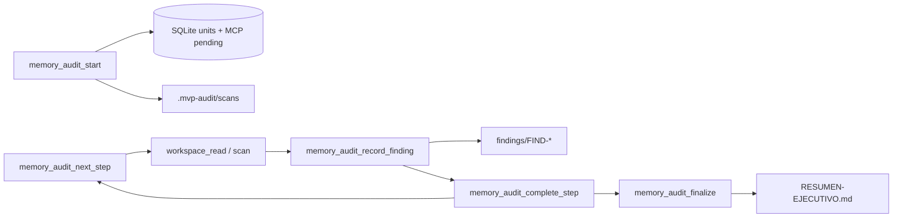

# Guía MCP — flujo simple

Documentación extendida: [`audit_orchestration.md`](audit_orchestration.md) — también prompt MCP **`audit-orchestration`**.

## Ejemplo (repositorio bajo auditoría)

```text
memory_audit_start(
  target_directory="/path/to/your/repository",
  profile_id="security-static-first",
  output_dir=".mvp-audit",
  reset=true
)
```

Respuesta: `project_id` generado automáticamente, informes en  
`/path/to/your/repository/.mvp-audit/`.

## Prompts MCP (sin tools previas)

| Prompt | Para qué |
|--------|----------|
| `audit-quickstart` | Pasos + JSON/calls con tu ruta |
| `audit-orchestration` | Diagrama + pseudocódigo |
| `audit-security-static-first` | Perfil + ejemplos de invocación |
| `guide-cline` | Config MCP en VS Code |

## Bucle (después de audit_start)

```
memory_audit_next_step(project_id="<project_id>")
memory_workspace_read(project_id="<project_id>", rel_path="init.js", line_limit=120)
memory_audit_record_finding(project_id="<project_id>", severity="high", title="...", ...)
memory_audit_complete_step(project_id="<project_id>", unit_id="chunk-0001", notes="...")
memory_audit_finalize(project_id="<project_id>")
```

## Inspector MCP

```bash
./scripts/run-mcp-inspector.sh
```

## Diagrama resumido


