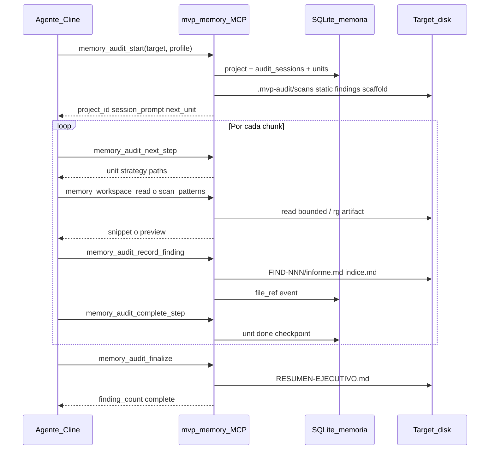

# Ejemplos de invocación — auditoría MCP

Sustituye solo `TARGET` si tu ruta es otra.

```text
TARGET=/path/to/your/repository
PROFILE=security-static-first
OUTPUT=.mvp-audit
```

Tras el paso 1, guarda el `project_id` de la respuesta (ej. `my-repo-a1b2c3`).

---

## Paso 1 — Arranque (obligatorio)

**Tool:** `memory_audit_start`

```json
{
  "target_directory": "/path/to/your/repository",
  "profile_id": "security-static-first",
  "output_dir": ".mvp-audit",
  "reset": true
}
```

**Qué hace el servidor:** calcula `project_id`, crea proyecto MCP, plan de ficheros (chunks), ejecuta `rg` → `TARGET/.mvp-audit/scans/`, opcional semgrep/gitleaks → `static/`, tareas en memoria, `findings/00-scan-index.md`.

**Respuesta útil:** `project_id`, `output_dir`, `session_prompt`, `next_tool` = `memory_audit_next_step`.

---

## Paso 2 — Estado (opcional, entre sesiones)

**Tool:** `memory_audit_status`

```json
{ "project_id": "<project_id>" }
```

---

## Paso 3 — Bucle por unidad de código

**Tool:** `memory_audit_next_step`

```json
{ "project_id": "<project_id>" }
```

**Tool:** `memory_workspace_read` (fichero pequeño / ventana)

```json
{
  "project_id": "<project_id>",
  "rel_path": "init.js",
  "line_offset": 1,
  "line_limit": 120
}
```

**Tool:** `memory_workspace_scan_patterns` (bundle grande, un patrón)

```json
{
  "project_id": "<project_id>",
  "pattern": "innerHTML",
  "rel_path": "init.js",
  "max_count": 15
}
```

---

## Paso 4 — Persistir hallazgo en disco (obligatorio por issue)

**Tool:** `memory_audit_record_finding`

```json
{
  "project_id": "<project_id>",
  "severity": "high",
  "title": "XSS via innerHTML in _logToConsole",
  "cwe": "CWE-79",
  "file_path": "init.js",
  "line": 40,
  "description": "User-controlled message assigned to innerHTML.",
  "evidence": "fragmento de código o línea rg",
  "poc_markdown": "En DevTools: ... pasos para reproducir ..."
}
```

Crea: `TARGET/.mvp-audit/findings/FIND-NNN-.../informe.md` y fila en `indice.md`.

---

## Paso 5 — Cerrar unidad del plan

**Tool:** `memory_audit_complete_step`

```json
{
  "project_id": "<project_id>",
  "unit_id": "chunk-0001",
  "notes": "init.js revisado; 2 findings registrados",
  "skip": false
}
```

Repetir pasos 3–5 hasta que `next_unit` sea null.

---

## Paso 6 — Cierre de auditoría (obligatorio)

**Tool:** `memory_audit_finalize`

```json
{ "project_id": "<project_id>" }
```

Genera `TARGET/.mvp-audit/RESUMEN-EJECUTIVO.md`. No declares “audit complete” en el chat si `finding_count` = 0.

---

## Perfiles (`profile_id`)

| profile_id | Cuándo usarlo |
|------------|----------------|
| `security-full` | Todo: secretos, consola, XSS/SQLi/SSRF |
| `security-static-first` | Igual + semgrep + gitleaks si instalados |
| `js-console-api` | Solo APIs `window` / consola |
| `security-baseline` | Secretos, storage, sinks |
| `security-injection` | Solo inyecciones |

---

## Pseudocódigo del orquestador

```
ON memory_audit_start(target, profile_id):
  project_id ← hash(workspace_path)
  CREATE/UPDATE project in SQLite (MCP Memory)
  LOAD profile JSON (searches, tasks, static_tools)
  SCAFFOLD target/.mvp-audit/{findings,poc,scans,static}
  PLAN ← walk(target) → workspace_units (1 file ≈ 1 chunk)
  FOR each search IN profile: RUN rg → .mvp-audit/scans/<id>.txt
  IF static_tools: RUN semgrep/gitleaks → .mvp-audit/static/
  WRITE findings/00-scan-index.md
  MCP ← add_decision + add_pending(tasks)
  RETURN project_id, session_prompt, next_unit

LOOP until no pending units:
  ON memory_audit_next_step(project_id):
    RETURN next chunk {rel_paths, strategy, hints}

  AGENT analyzes using memory_workspace_read / scan_patterns

  ON memory_audit_record_finding(...):
    WRITE findings/FIND-NNN-*/informe.md + indice.md + MCP file_ref

  ON memory_audit_complete_step(project_id, unit_id):
    MARK unit done in workspace_units
    UPDATE MCP checkpoint

ON memory_audit_finalize(project_id):
  WRITE RESUMEN-EJECUTIVO.md
  IF finding_count == 0: WARN (chat-only audit invalid)
```

---

## Diagrama (componentes)


